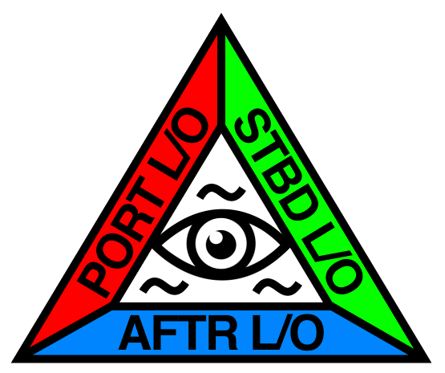

# All-SEAing Eye

<p align="center">
    
</p>

## Install mmdetection

Install mmdetection using [mmdet_install.ipynb](https://github.com/star-bits/all-seaing-eye/blob/main/mmdet_install.ipynb).

## Download dataset

Download dataset from [AI Hub 해상 객체 이미지](https://aihub.or.kr/aidata/34155)

## Rename image files and Generate annotation files

Organize the dataset directory as follows:
```
./mmdetection/data/
    test/
        images/
            20201112/
            ...
    train/
        images/
            20201216/
            ...
        labels/
            20201216/
            ...
    valid/
        images/
            20201224/
            ...
        labels/
            20201224/
            ...
```
Put [anns_generate_files_rename.ipynb](https://github.com/star-bits/all-seaing-eye/blob/main/anns_generate_files_rename.ipynb) inside `mmdetection/data` and run it. It'll rename filenames from Korean to English (which is vital for mmdetection model to process images), and create annotation files `test.json`, `train.json`, and `valid.json` in COCO format. 

## Train and Inference

Place [test.ipynb](https://github.com/star-bits/all-seaing-eye/blob/main/test.ipynb), and [train.ipynb](https://github.com/star-bits/all-seaing-eye/blob/main/train.ipynb) in `mmdetection/tools` and run `train.ipynb` to train, and `test.ipynb` to get inference. 

Cascade R-CNN with ResNet-101 backbone is used. 

With image size of 768x432, the inference speed is 22.5 FPS. mAP score is 0.226. 

### Inference results visualized:


